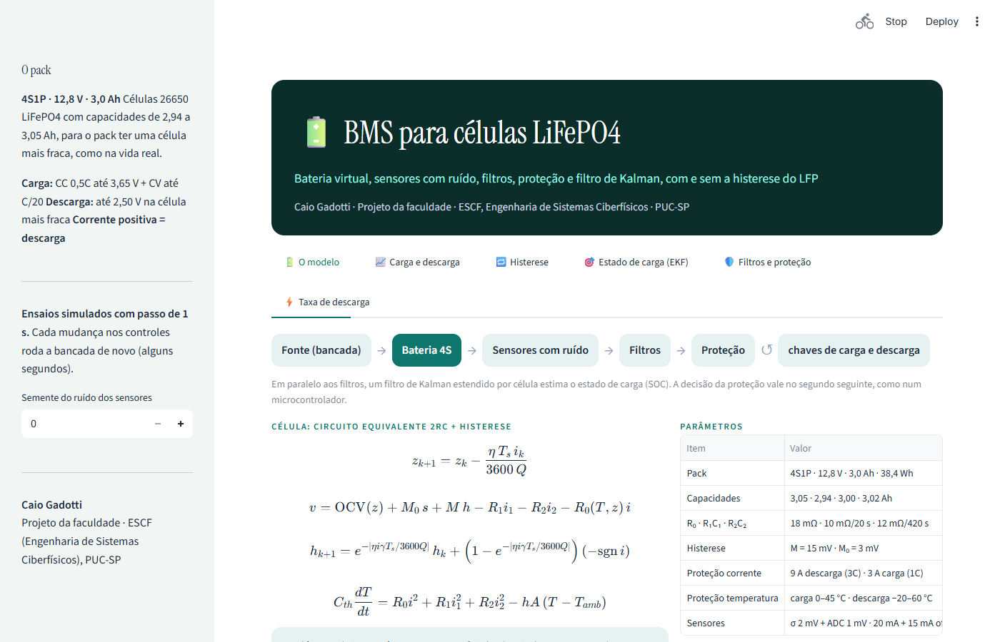
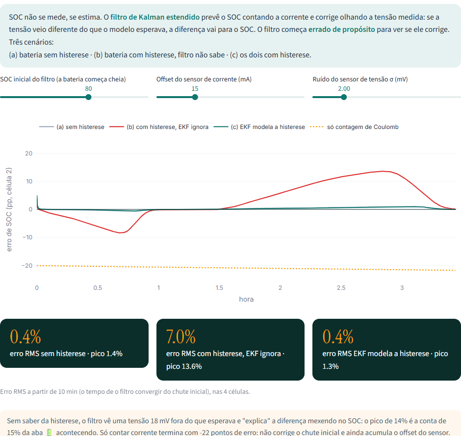
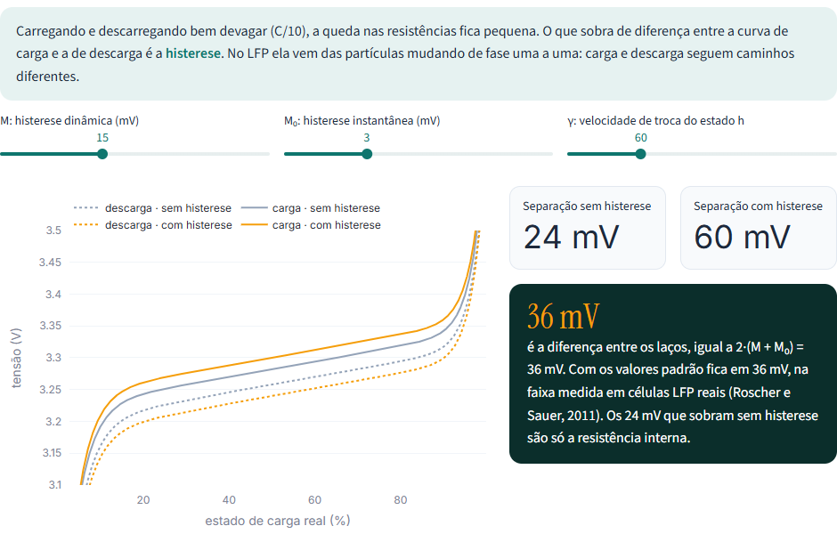
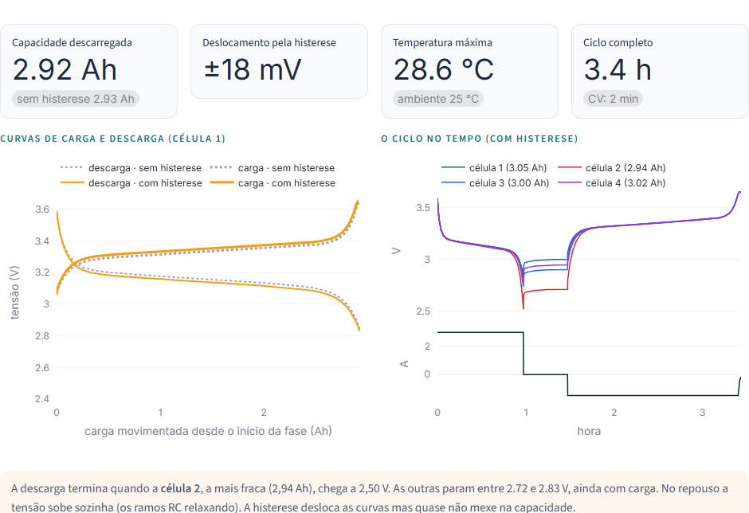
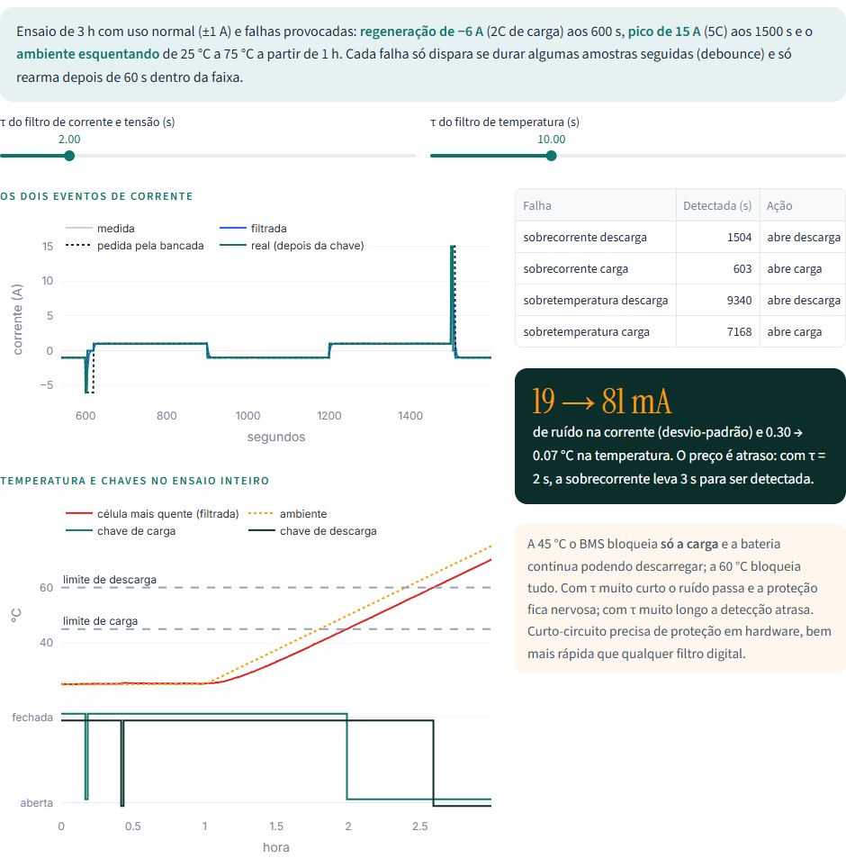

<div align="center">

# BMS for LiFePO4 Cells

**How much charge is left, and what happens when the BMS ignores hysteresis?**

A simulation of a battery management system (BMS) for a four-cell LiFePO4 pack: a virtual battery,
noisy sensors, filters, protection and a Kalman filter estimating state of charge, in an
interactive dashboard.

[](https://www.python.org)
[](https://numpy.org)
[](https://streamlit.io)
[](https://plotly.com/python/)
[](tests/)

`Ignoring hysteresis takes SOC error from 0.4% to 7.0%, peaking at 13.6%`

[Português](README.md) &nbsp;·&nbsp; **English**

</div>



> The interface is in Portuguese. Main terms: *carga/descarga* = charge/discharge,
> *estado de carga (SOC)* = state of charge, *célula* = cell, *chave* = switch.

---

## The problem

The BMS looks after the battery: it measures voltage, current and temperature, estimates how much
charge is left and opens the charge or discharge switch when something goes out of bounds. The hard
part is estimating **state of charge (SOC)**, which can't be measured directly.

LiFePO4 makes that estimate especially tricky for two reasons:

- the voltage curve is **very flat**: mid-range, voltage changes only 1.2 mV per SOC point;
- the cell has **hysteresis**: at the same SOC, voltage after charging sits about 18 mV above voltage
  after discharging.

The arithmetic is simple: 18 mV ÷ 1.2 mV/% ≈ 15 SOC points. An estimator that doesn't know about
hysteresis can be off by all of that.

The original version of this work was built in MATLAB/Simulink, in place of a bench test with a
teaching BMS kit that broke. This repository reimplements the same model in Python, with an
interactive dashboard to change parameters and see the effect right away.

## The model

```
Bench (source) → 4S battery → Noisy sensors → Filters → Protection ↺ charge/discharge switches
                                           ↘ EKF per cell → estimated SOC
```

**Cell: 2RC equivalent circuit + Plett hysteresis**

```
z[k+1] = z[k] − η·Ts·i / (3600·Q)                        Coulomb counting
v      = OCV(z) + M₀·s + M·h − R₁·i₁ − R₂·i₂ − R₀(T,z)·i  terminal voltage
h[k+1] = e^(−|ηiγTs/3600Q|)·h + (1 − e^(…))·(−sgn i)     hysteresis goes to +1 on charge, −1 on discharge
Cth·dT/dt = R₀i² + R₁i₁² + R₂i₂² − hA·(T − Tamb)          thermal, one node per cell
```

R₀ grows in the cold (Arrhenius) and near empty or full (polarization). The four cells differ a
little on purpose, because in real packs the weakest one ends the discharge.

| Item | Value |
|---|---|
| Pack | 4S1P · 12.8 V · 3.0 Ah · 38.4 Wh |
| Capacities | 3.05 · 2.94 · 3.00 · 3.02 Ah |
| R₀ · R₁C₁ · R₂C₂ | 18 mΩ · 10 mΩ/20 s · 12 mΩ/420 s |
| Hysteresis | M = 15 mV · M₀ = 3 mV |
| Charge · discharge | CC 0.5C to 3.65 V + CV to C/20 · 1C to 2.50 V on the weakest cell |
| Protection | 9 A discharge · 3 A charge · charge 0–45 °C · discharge −20–60 °C |
| Sensors | σ 2 mV + 1 mV ADC · 20 mA + 15 mA offset · 0.3 °C |

**BMS:** first-order low-pass filters (τ = 2 s for current and voltage, 10 s for temperature),
protection covering 8 faults with debounce and re-arming only after 60 s back in range, and an
**extended Kalman filter** per cell with state [SOC, i₁, i₂, h] that starts wrong on purpose (80%
with a full battery). Protection decisions apply on the next second, as on a microcontroller.

## What each tab shows

| Tab | What you can do | Result with default values |
|---|---|---|
| O modelo (model) | equations, parameters and the OCV curve with its hysteresis band | 18 mV ÷ 1.2 mV/% ≈ 15% potential error |
| Carga e descarga (charge/discharge) | change charge and discharge rates, compare with and without hysteresis | 2.92 Ah at 1C; curves shifted ±18 mV; cell 2 ends the discharge |
| Histerese (hysteresis) | change M, M₀ and γ in the slow test (C/10) | 24 mV gap without hysteresis, 60 mV with: a 36 mV difference = 2·(M + M₀) |
| Estado de carga (SOC) | change the initial guess, sensor offset and noise | RMS error 0.4% → **7.0%** (peak 13.6%) → 0.4%; Coulomb counting alone ends at −22% |
| Filtros e proteção (filters and protection) | change filter time constants | noise 19 → 8 mA and 0.30 → 0.07 °C; every fault caught, no false alarms |
| Taxa de descarga (C-rate) | compare C/5 to 3C | from C/2 to 2C: −146 mV mean voltage, −2% capacity, 35.7 °C |

<p align="center">
  
  
</p>

### The main result

Three scenarios on the same test (1C discharge, rest, CC/CV charge):

| Scenario | SOC RMS error | Peak |
|---|---|---|
| (a) battery without hysteresis | 0.4% | 1.4% |
| (b) battery with hysteresis, filter unaware | **7.0%** | **13.6%** |
| (c) filter models hysteresis | 0.4% | 1.3% |
| plain Coulomb counting | — | ends at −22% |

In scenario (b) the filter sees a voltage 18 mV off from what it expected and "explains" the gap by
moving SOC. The 13.6% peak is the 15% estimate playing out. Modeling hysteresis fixes it. Coulomb
counting alone never corrects the initial guess and also accumulates the sensor offset.

<p align="center">
  
  
</p>

### Protection

| Induced event | Detected | Action |
|---|---|---|
| −6 A regeneration (2C charge) at 600 s | 603 s | opens the charge switch |
| 15 A spike (5C) at 1500 s | 1504 s | opens the discharge switch |
| Cell above 45 °C (ambient heating up) | 7168 s | blocks **charging only** |
| Cell above 60 °C | 9340 s | blocks discharging |

The 3 s delay comes from the filter plus debounce: fine for overcurrent, but a short circuit needs
hardware protection.

## Validation

| Test | What it checks |
|---|---|
| `test_contagem_de_coulomb_fecha_com_a_capacidade` | discharging Q/2 removes exactly 50% SOC |
| `test_ocv_monotona_e_patamar_plano` | OCV always increasing, 1.2 mV/% slope mid-range |
| `test_derivada_da_ocv_bate_com_diferenca_finita` | the derivative used by the EKF is correct |
| `test_histerese_vai_para_mais_um_e_menos_um` | the h state saturates at ±1 |
| `test_laco_de_histerese_c10` | the loop grows by exactly 2·(M + M₀) |
| `test_descarga_para_na_celula_mais_fraca` | discharge ends on the 2.94 Ah cell at 2.50 V |
| `test_carga_nunca_passa_de_vmax` | CC/CV respects 3.65 V |
| `test_ekf_converge_do_soc_errado` | starts 20 points off and settles below 2% RMS |
| `test_ignorar_histerese_piora_o_soc` | scenario (b) errs over 3x the others, peaking above 10% |
| `test_coulomb_puro_nao_corrige_o_erro_inicial` | Coulomb counting ends more than 18 points off |
| `test_filtro_reduz_ruido` | low-pass cuts current and temperature noise |
| `test_protecao_dispara_e_abre_a_chave_certa` | detection times and the right switch for each fault |
| `test_sem_disparo_falso_em_uso_normal` | one hour of normal use with no alarms |
| `test_c_rate_maior_baixa_tensao_e_capacidade_e_esquenta` | effect of discharge rate |

```bash
python -m pytest tests
```

## Running it

```bash
git clone https://github.com/caiogadotti/bms-lifepo4.git
cd bms-lifepo4
pip install -r requirements.txt
streamlit run app.py
```

### Deploying to Streamlit Community Cloud

1. Sign in at [share.streamlit.io](https://share.streamlit.io) with your GitHub account.
2. Click **Create app** and pick this repository, branch `main`, file `app.py`.
3. Click **Deploy**. The light theme comes from `.streamlit/config.toml`.

## Layout

```
app.py                  Streamlit dashboard (six tabs)
bms.py                  cell, sensors, filters, protection, EKF and bench tests
tests/test_bms.py       14 tests
.streamlit/config.toml  visual theme
docs/                   README images
```

## References

- PLETT, G. L. *Battery management systems: volume I: battery modeling*. Boston: Artech House, 2015.
- PLETT, G. L. Extended Kalman filtering for battery management systems of LiPB-based HEV battery packs: parts 2-3. *Journal of Power Sources*, v. 134, 2004.
- DREYER, W. et al. The thermodynamic origin of hysteresis in insertion batteries. *Nature Materials*, v. 9, p. 448-453, 2010.
- ROSCHER, M. A.; SAUER, D. U. Dynamic electric behavior and open-circuit-voltage modeling of LiFePO4-based lithium ion secondary batteries. *Journal of Power Sources*, v. 196, p. 331-336, 2011.
- MATHWORKS. *Battery current and temperature fault monitoring* (Simscape Battery example). Natick: The MathWorks.

---

Caio Gadotti · Coursework, Cyber-Physical Systems Engineering (ESCF), PUC-SP.
