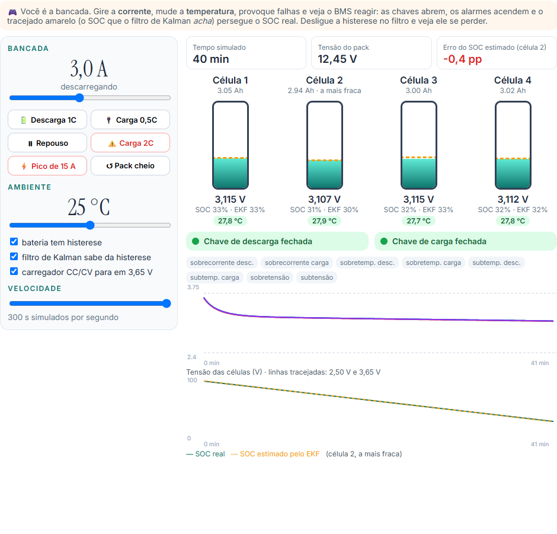

<div align="center">

# BMS para células LiFePO4

**Quanto de carga tem a bateria, e o que acontece quando o BMS ignora a histerese?**

Simulação de um sistema de gerenciamento de bateria (BMS) para um pack de quatro células
LiFePO4: bateria virtual, sensores com ruído, filtros, proteção e um filtro de Kalman estimando o
estado de carga, num painel interativo.

[](https://www.python.org)
[](https://numpy.org)
[](https://streamlit.io)
[](https://plotly.com/python/)
[](tests/)

`Ignorar a histerese leva o erro de SOC de 0,4% para 7,0%, com pico de 13,6%`

**Português** &nbsp;·&nbsp; [English](README.en.md)

</div>




---

## O problema

O BMS é o sistema que cuida da bateria: mede tensão, corrente e temperatura, estima quanto de carga
ainda resta e abre as chaves de carga ou descarga quando algo sai do limite. A parte difícil é a
estimativa do **estado de carga (SOC)**, que não dá para medir direto.

No LiFePO4 essa estimativa é especialmente traiçoeira por dois motivos:

- a curva de tensão é **muito plana**: no meio da carga, a tensão muda só 1,2 mV por ponto de SOC;
- a célula tem **histerese**: no mesmo SOC, a tensão depois de carregar fica uns 18 mV acima da
  tensão depois de descarregar.

A conta é simples: 18 mV ÷ 1,2 mV/% ≈ 15 pontos de SOC. Um estimador que não sabe da histerese pode
errar isso tudo.

A versão original deste trabalho foi feita em MATLAB/Simulink, no lugar do ensaio de bancada com um
kit didático de BMS que quebrou. Este repositório reimplementa o mesmo modelo em Python, com um
painel interativo para mexer nos parâmetros e ver o efeito na hora.

## O modelo

```
Bancada (fonte) → Bateria 4S → Sensores com ruído → Filtros → Proteção ↺ chaves de carga/descarga
                                                 ↘ EKF por célula → SOC estimado
```

**Célula: circuito equivalente 2RC + histerese de Plett**

```
z[k+1] = z[k] − η·Ts·i / (3600·Q)                        contagem de Coulomb
v      = OCV(z) + M₀·s + M·h − R₁·i₁ − R₂·i₂ − R₀(T,z)·i  tensão terminal
h[k+1] = e^(−|ηiγTs/3600Q|)·h + (1 − e^(…))·(−sgn i)     histerese vai a +1 na carga, −1 na descarga
Cth·dT/dt = R₀i² + R₁i₁² + R₂i₂² − hA·(T − Tamb)          térmico, um nó por célula
```

R₀ cresce no frio (Arrhenius) e perto de vazia ou cheia (polarização). As quatro células são um
pouco diferentes de propósito, porque na vida real a mais fraca define o fim da descarga.

| Item | Valor |
|---|---|
| Pack | 4S1P · 12,8 V · 3,0 Ah · 38,4 Wh |
| Capacidades | 3,05 · 2,94 · 3,00 · 3,02 Ah |
| R₀ · R₁C₁ · R₂C₂ | 18 mΩ · 10 mΩ/20 s · 12 mΩ/420 s |
| Histerese | M = 15 mV · M₀ = 3 mV |
| Carga · descarga | CC 0,5C até 3,65 V + CV até C/20 · 1C até 2,50 V na célula mais fraca |
| Proteção | 9 A descarga · 3 A carga · carga 0–45 °C · descarga −20–60 °C |
| Sensores | σ 2 mV + ADC 1 mV · 20 mA + 15 mA de offset · 0,3 °C |

**BMS:** filtro passa-baixa de 1ª ordem (τ = 2 s para corrente e tensão, 10 s para temperatura),
proteção com 8 falhas, *debounce* e rearme só depois de 60 s dentro da faixa, e um **filtro de Kalman
estendido** por célula com estado [SOC, i₁, i₂, h], que começa errado de propósito (80% com a bateria
cheia). A decisão da proteção vale no segundo seguinte, como num microcontrolador.

## O que cada aba mostra

| Aba | O que dá para fazer | Resultado com os valores padrão |
|---|---|---|
| Brinque | ser a bancada: girar a corrente, mudar a temperatura, provocar pico de 15 A, ligar e desligar a histerese | tudo ao vivo no navegador: células enchendo e esvaziando, chaves abrindo, SOC real contra o estimado |
| O modelo | equações, parâmetros e a curva OCV com a faixa de histerese | 18 mV ÷ 1,2 mV/% ≈ 15% de erro em potencial |
| Carga e descarga | mudar a taxa de carga e descarga, comparar com e sem histerese | 2,92 Ah a 1C; curvas deslocadas ±18 mV; a célula 2 encerra a descarga |
| Histerese | mexer em M, M₀ e γ no ensaio lento (C/10) | separação de 24 mV sem histerese e 60 mV com: diferença de 36 mV = 2·(M + M₀) |
| Estado de carga (EKF) | mudar o chute inicial, o offset do sensor e o ruído | erro RMS de 0,4% → **7,0%** (pico 13,6%) → 0,4%; só contar corrente termina com −22% |
| Filtros e proteção | mudar a constante de tempo dos filtros | ruído de 19 → 8 mA e 0,30 → 0,07 °C; todas as falhas detectadas, nenhum alarme falso |
| Taxa de descarga | comparar C/5 a 3C | de C/2 para 2C: −146 mV de tensão média, −2% de capacidade, 35,7 °C |

<p align="center">
  
  
</p>

### O resultado principal

Três cenários com o mesmo ensaio (descarga a 1C, repouso, carga CC/CV):

| Cenário | Erro RMS de SOC | Pico |
|---|---|---|
| (a) bateria sem histerese | 0,4% | 1,4% |
| (b) bateria com histerese, filtro não sabe | **7,0%** | **13,6%** |
| (c) filtro modela a histerese | 0,4% | 1,3% |
| contagem de Coulomb pura | — | termina em −22% |

No cenário (b) o filtro vê uma tensão 18 mV fora do que esperava e "explica" a diferença mexendo
no SOC. O pico de 13,6% é a conta de 15% acontecendo. Modelar a histerese resolve. A contagem de
Coulomb sozinha nunca corrige o chute inicial e ainda acumula o offset do sensor.

<p align="center">
  
  
</p>

### Proteção

| Evento provocado | Detecção | Ação |
|---|---|---|
| Regeneração de −6 A (2C de carga) aos 600 s | 603 s | abre a chave de carga |
| Pico de 15 A (5C) aos 1500 s | 1504 s | abre a chave de descarga |
| Célula passa de 45 °C (ambiente esquentando) | 7168 s | bloqueia **só a carga** |
| Célula passa de 60 °C | 9340 s | bloqueia a descarga |

O atraso de 3 s vem do filtro mais o *debounce*: suficiente para sobrecorrente, mas curto-circuito
precisa de proteção em hardware.

## Validação

| Teste | O que verifica |
|---|---|
| `test_contagem_de_coulomb_fecha_com_a_capacidade` | descarregar Q/2 tira exatamente 50% de SOC |
| `test_ocv_monotona_e_patamar_plano` | OCV sempre crescente, inclinação de 1,2 mV/% no meio |
| `test_derivada_da_ocv_bate_com_diferenca_finita` | a derivada usada pelo EKF está certa |
| `test_histerese_vai_para_mais_um_e_menos_um` | o estado h satura em ±1 |
| `test_laco_de_histerese_c10` | o laço cresce exatamente 2·(M + M₀) |
| `test_descarga_para_na_celula_mais_fraca` | a descarga termina na célula de 2,94 Ah, a 2,50 V |
| `test_carga_nunca_passa_de_vmax` | o CC/CV respeita 3,65 V |
| `test_ekf_converge_do_soc_errado` | parte de 20 pontos de erro e fica abaixo de 2% RMS |
| `test_ignorar_histerese_piora_o_soc` | o cenário (b) erra mais de 3x os outros, com pico acima de 10% |
| `test_coulomb_puro_nao_corrige_o_erro_inicial` | a contagem de Coulomb termina com mais de 18 pontos de erro |
| `test_filtro_reduz_ruido` | o passa-baixa corta o ruído de corrente e temperatura |
| `test_protecao_dispara_e_abre_a_chave_certa` | tempos de detecção e chave aberta em cada falha |
| `test_sem_disparo_falso_em_uso_normal` | uma hora de uso normal sem nenhum alarme |
| `test_c_rate_maior_baixa_tensao_e_capacidade_e_esquenta` | efeito da taxa de descarga |

```bash
python -m pytest tests
```

## Como rodar

```bash
git clone https://github.com/caiogadotti/bms-lifepo4.git
cd bms-lifepo4
pip install -r requirements.txt
streamlit run app.py
```

### Publicar no Streamlit Community Cloud

1. Entre em [share.streamlit.io](https://share.streamlit.io) com a conta do GitHub.
2. Clique em **Create app** e escolha este repositório, branch `main`, arquivo `app.py`.
3. Clique em **Deploy**. O tema claro vem de `.streamlit/config.toml`.

## Estrutura

```
app.py                  painel Streamlit (sete abas)
brinque.html            bancada ao vivo da aba Brinque (o mesmo modelo em JavaScript)
bms.py                  célula, sensores, filtros, proteção, EKF e ensaios de bancada
tests/test_bms.py       14 testes
.streamlit/config.toml  tema visual
docs/                   imagens do README
```

## Referências

- PLETT, G. L. *Battery management systems: volume I: battery modeling*. Boston: Artech House, 2015.
- PLETT, G. L. Extended Kalman filtering for battery management systems of LiPB-based HEV battery packs: parts 2-3. *Journal of Power Sources*, v. 134, 2004.
- DREYER, W. et al. The thermodynamic origin of hysteresis in insertion batteries. *Nature Materials*, v. 9, p. 448-453, 2010.
- ROSCHER, M. A.; SAUER, D. U. Dynamic electric behavior and open-circuit-voltage modeling of LiFePO4-based lithium ion secondary batteries. *Journal of Power Sources*, v. 196, p. 331-336, 2011.
- MATHWORKS. *Battery current and temperature fault monitoring* (exemplo do Simscape Battery). Natick: The MathWorks.

---

Caio Gadotti · Projeto da faculdade, curso de Engenharia de Sistemas Ciberfísicos (ESCF) da PUC-SP.
